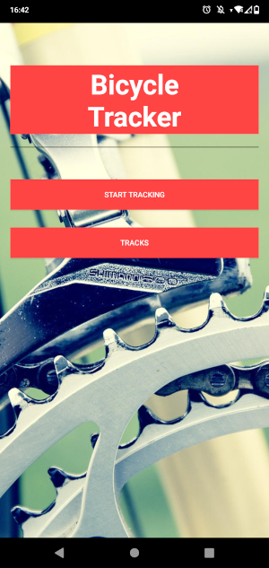
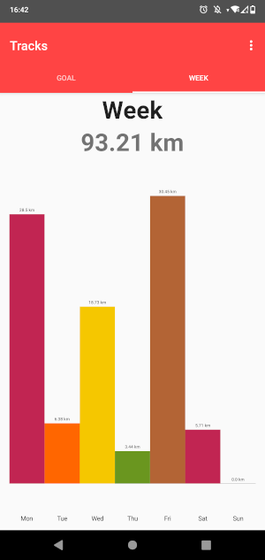
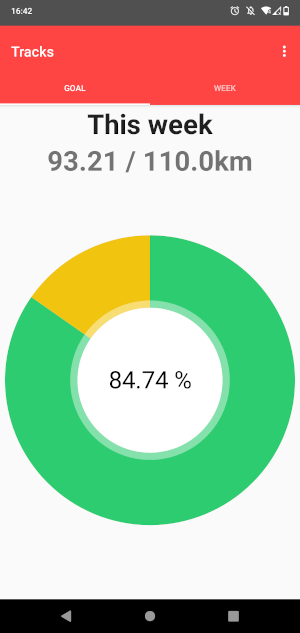

# Android Bicycle Tracker

The purpose of this app is to track biking activity and show statistics over the weekly and daily routes.

## Features
* Track your biking activity using the "Start Tracking" button
* Set a weekly distance goal
* Show the progress of the weekly goal and the distance per day in the "Tracks" view

## Notes
* the tracking service will run as a foreground system service using GNSS as a location provider
* tested and currently used on an Android 10 system

## Screenshots
  